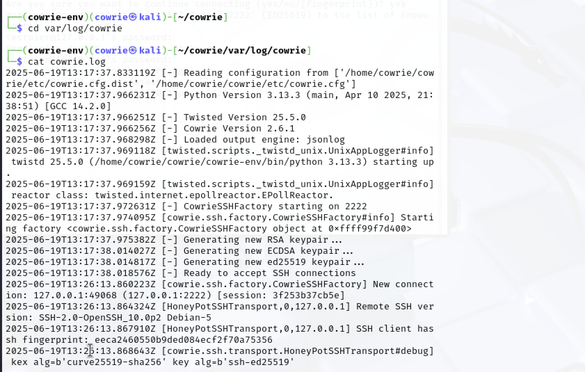

# 🧪 Cowrie Honeypot Project – Kali Linux (UTM VM)

## 📸 Step-by-Step Screenshots

### ✅ Step 1: System Update
Checked for updates and ensured package compatibility before honeypot setup.  

---

### ✅ Step 2: Installed Dependencies
Installed dependencies required to run Cowrie Honeypot.  

---

### ✅ Step 3: Created Dedicated User
Created a dedicated user ‘nati’ to follow security best practices.  

---

### ✅ Step 4: Switched to Cowrie User  
Switched to cowrie user for isolated honeypot setup.  

---

### ✅ Step 5: Cloned Cowrie Files  
Downloaded Cowrie files into a working directory for setup.  

---

### ✅ Step 6: Virtual Environment  
Using virtual environment to keep Cowrie dependencies isolated.  

---

### ✅ Step 7: Installed Python Requirements  
Installed Cowrie’s required Python packages inside the virtual environment.  

---

### ✅ Step 8: Edited Config File  
Changed Cowrie’s SSH port to 2222 to avoid conflict with real SSH.  

---

### ✅ Step 9: Started Honeypot  
Started the honeypot so it can listen for fake SSH/Telnet logins.  

---

### ✅ Step 10: Log Output  
Log files show unauthorized login attempts and interaction history.  

